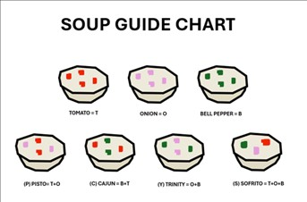

## **Special Soups**

Chef has perfected a universal soup base and is excited to create delightful flavors by adding available ingredients: tomato (t), onion (o), and bell pepper (b). He can mix these ingredients in various ways to achieve six distinct flavors: 
- **t**: Tomato
- **o**: Onion
- **b**: Bell Pepper
- **y**: Trinity (onion + bell pepper)
- **p**: Pisto (tomato + onion)
- **c**: Cajun (bell pepper + tomato)
- **s**: Sofrito (tomato + onion + bell pepper)

Chef has **N** bowls lined up in a one-dimensional array and must add the specified flavors based on a given input, where each flavor is represented by a character. However, the order in which the ingredients are added doesn't matter, and Chef aims to minimise the number of moves required. Your task is to determine the minimum number of moves in which the Chef needs to add the ingredients for all N bowls.

**Note that consecutive bowls requiring the same flavour count as a single move.**



### **Constraints**:
- _1 ≤ T ≤ 5_
- _1 ≤ N ≤ 100_


### **Input Format**:
1. The first line contains an integer **T** representing the number of test cases.
2. For each test case:
   - A line with an integer **N**, representing the number of bowls.
   - A line with **N** characters (separated by spaces) representing the required flavors. Each character is one of: ('o', 'b', 't', 's', 'y', 'c', 'p').


### **Output Format**:
For each test case, output a single integer representing the minimum number of moves Chef needs to make.


### **Sample Input**:
```
2
6
t c p s y b
5
o s b t o
```

### **Sample Output**:
```
4
5
```

### **Explanation**:

1. **First test case**:
   - The bowls: `t c p s y b`
   - **Component-wise breakdown**:
     ```
     t o b
     1 0 0
     1 0 1
     1 1 0
     1 1 1
     0 1 1
     0 0 1
     ```
   - From the matrix visualization, there is:
     - **1 move** for tomato,
     - **1 move** for onion,
     - **2 moves** for bell-peppers.
   - Hence, the total moves = 4.

2. **Second test case**:
   - The bowls: `o s b t o`
   - Similarly, the total moves = 5.


### **Python Solution [O(n)]**:

```python
ingredients = {
    't': ['t'],
    'o': ['o'],
    'b': ['b'],
    'c': ['t', 'b'],
    'y': ['o', 'b'],
    'p': ['t', 'o'],
    's': ['t', 'o', 'b']
}


def count_continuations(array):
    continuations = [0, 0, 0]
    counts = [0, 0, 0]

    for row in array:
        for col in range(3):
            if row[col]:
                if not counts[col]:
                    continuations[col] += 1
                counts[col] += 1
            else:
                counts[col] = 0

    return sum(continuations)


if __name__ == '__main__':
    t = int(input())
    for _ in range(t):
        n = int(input())
        ingredients_list = input().split()

        primary = [
            [
                int('t' in ingredients[i]),
                int('o' in ingredients[i]),
                int('b' in ingredients[i])
            ]
            for i in ingredients_list
        ]

        result = count_continuations(primary)
        print(result)


```
