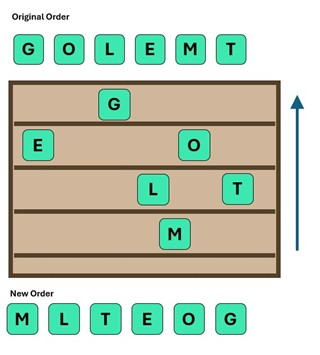

## **A Spicy Change**

Chef is tired of his usual methods for arranging spices in his recipes. Chef wants to arrange his spices, each labelled with a letter from `'A'` to `'Z'` to represent their spiciness level (`A` is the least spicy and `Z` is the spiciest). Chef organises these spices on shelves so that they form a triangular shape. He only has one of each spice.

- If the next spice is less spicy than the spice on the current shelf, Chef places it on the left on the shelf below it.
- If the next spice is spicier, Chef places it on the right on the shelf below it.

The triangular shape indicates that each spice has either strictly less spicy spices placed to its left (on the same or lower shelf) or spicier spices placed to its right.

After all the spices are placed, Chef picks them up starting from the bottom shelf, moving left to right and proceeds to the shelf above.

Your task is to determine the new order of spices after the Chef's rearrangement.


### **Constraints:**
- _1 ≤ n ≤ 26_



### **Input Format:**
The input contains a string of `n` uppercase letters, representing the spices in the order they are added to the dish.

### **Output Format:**
Output a string of `n` uppercase letters representing the new order of spices after Chef completes his rearrangement process.

### **Sample Input:**
```
GOLEMT
```

### **Sample Output:**
```
MLTEOG
```

### **Explanation:**
Starting with G, we have O next. Since O>G, O will go right to G in next shelf. Next, L > G, so L will go right, but since O already exists there, and L < G, L will go left to G in 3rd shelf. Next, E < G, so E will go left to G in 2nd shelf. Next, M > G, M will go right to G. But since O already exist there, and M < O, M will go left of O. But here also L has already been placed in 3rd shelf to the left of O, and M > L, M goes to right of L on 4th shelf. Next, T > G and T > O, to T will go right of O in 3rd shelf.

Ging from Bottom to Top, Right to Left, we the the following order: MLTEOG for given input.


### **Solution [O(n)]:**

```python
inp = input()
class Node():
  def __init__(self,v):
    self.left = None
    self.right = None
    self.parent = None
    self.val = v

  def add_node(self, val):
    if val < self.val:
      if self.left is not None:
        self.left.add_node(val)
      else:
        self.left = Node(val)
    elif val > self.val:
      if self.right is not None:  
        self.right.add_node(val)
      else:
        self.right = Node(val)
   
root = None
for c in inp:
  if root is None:
    root = Node(c)
  else:
    root.add_node(c)

levels = {}
def print_tree(level, node):
  vals = levels[level] if level in levels else ""
  vals += node.val
  levels[level] = vals
  if node.left:
    print_tree(level+1, node.left)
  if node.right:
    print_tree(level+1, node.right)
print_tree(0, root)

levels_r = list(levels.keys())
levels_r.reverse()
for level in levels_r:
  print(levels[level], end="")

```
