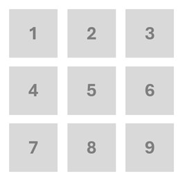

## **Knucklebones**

Chef had invited their friend for a game of knucklebones, alas both are suffering from temporary vision impairment and have relied on you to find the winner. In knucklebones both the players play in a **3×3** grid with **9** dice each. The winner is decided based on the player with the most points through their die once all dice rolls are over.

Certain rules of the game to note:

- Whenever a die is played in a column, and if there are any dice with the same number on the same column for the opponent, those dice with the same number are reduced to `0`
- At the end when all the dice are played, if any column has two or three dice with the same value in them, each of their values is doubled or tripled respectively.

The chef and their friend will be playing the dice one by one in linear order i.e.,

That is to say they will move from the order of a basic matrix starting from left to right on the first row, then left to right on the second row and then left on the third row [As shown in the illustration]. The chef will be the first to move in his matrix’s first place . then friend in his boards 1st space.Then chef in 2nd..and so on until all the dice are over

Hence they will directly provide you all their dices place,you must calculate  the points for both of them and find who comes on top


### **Constraints:**
- _1 <= T <= 5_
- _1 <= K[i] <= 6 (Where K are 18 dice roll value)_



### **Input Format:**
- 1st line: number of dice roll sets (test cases)
- Next T lines: 18 space-separated integers from 1-6 (inclusive)

### **Output Format:**
- Chef's points: A
- Friend's points: B

### **Sample Input:**
```
1
1 2 3 4 5 6 1 2 3 4 5 6 1 2 3 4 5 6

```

### **Sample Output:**
```
Chef's points: 84
Friend's points: 105

```

### **Explanation:**

In the given sample each number will occupy a single column with chef having `1`,`3`,`5` and friend having `2`,`4`,`6` occupying each colums.Hence causing each of their values to be tripled at the end and output given.If there were at any points during the input a die was played with the similar number on the opposing columns. The oppones die would be destroyed.


### **Efficient Code [O(n)]:**

```cpp
#include <iostream>
#include <vector>

using namespace std;

const int N = 3;

void updateGrid(int playerGrid[N][N], int opponentGrid[N][N], int diceValue, int position) {
    int row = position / N;
    int col = position % N;
    for (int r = 0; r < N; r++) {
        if (opponentGrid[r][col] == diceValue) {
            opponentGrid[r][col] = 0;
        }
    }
    playerGrid[row][col] = diceValue;
}

int calculatePoints(int grid[N][N]) {
    int totalPoints = 0;
    for (int col = 0; col < N; col++) {
        int counts[7] = {0};
        for (int row = 0; row < N; row++) {
            counts[grid[row][col]]++;
        }
        for (int value = 1; value <= 6; value++) {
            if (counts[value] == 2) {
                totalPoints += value * 4;
            } else if (counts[value] == 3) {
                totalPoints += value * 9;
            } else {
                totalPoints += value * counts[value];
            }
        }
    }
    return totalPoints;
}

int main() {
    int testCases;
   
    cin >> testCases;

    vector<int> chefPointsResults(testCases);
    vector<int> friendPointsResults(testCases);

    for (int t = 0; t < testCases; t++) {
        int chefGrid[N][N] = {0};
        int friendGrid[N][N] = {0};
        int totalRolls = N * N * 2;
        int diceRolls[totalRolls];

        // Input dice rolls for current test case
        for (int i = 0; i < totalRolls; i++) {
            cin >> diceRolls[i];
        }

        // Process dice rolls for current test case
        for (int i = 0; i < totalRolls; i++) {
            int position = i / 2;
            if (i % 2 == 0) {
                updateGrid(chefGrid, friendGrid, diceRolls[i], position);
            } else {
                updateGrid(friendGrid, chefGrid, diceRolls[i], position);
            }
        }

        // Calculate points for Chef and Friend
        chefPointsResults[t] = calculatePoints(chefGrid);
        friendPointsResults[t] = calculatePoints(friendGrid);
    }


    for (int t = 0; t < testCases; t++) {

        cout << "Chef's points: " << chefPointsResults[t] << endl;
        cout << "Friend's points: " << friendPointsResults[t] << endl;
    }

    return 0;
}


```
