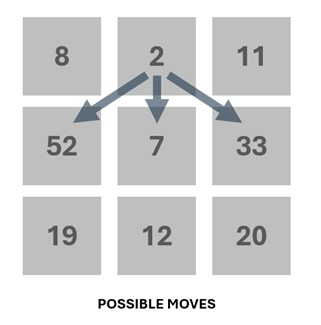

## **The Mystical Path**

Chef is on a treasure hunt in a mystical forest represented as a grid of `n x n` cells. Each cell contains a value that represents the amount of treasure in that cell. Chef can start from any cell in the first row and can move to **next row** (down) in following ways:

- Straight down, OR
- Diagonally down to the left/right

The goal is to collect the maximum amount of treasure by the time Chef reaches the last row.
Problem Statement: Given an `n x n` grid of integers representing the treasure values, write a program to determine the maximum treasure Chef can collect by the time he reaches the last row.

### **Constraints:**
- _1 ≤ n ≤ 100_
- _0 ≤ value ≤ 100_



### **Input Format:**
- First line contains integer `t` (no. of test cases)
- Next line contains integer `n`, representing the size of the grid.
- Next input is an `n x n` grid of integers where each integer value represents the treasure in that cell.

### **Output Format:**

Print the maximum treasure Chef can collect by the time he reaches the last row.

### **Sample Input:**
```
1
3
1 2 3
4 5 6
7 8 9

```

### **Sample Output:**
```
18

```

### **Explanation:**
Number of test cases given: 1
Size of matrix: 3 → 3x3 matrix
For given data, the path with maximum sum will be 3->6->9 (3+6+9 = 18) so answer is 18


### **Efficient Code [O(n)]:**

```c
#include <stdio.h>

int max_treasure(int n, int grid[n][n]) {
    int dp[n][n];

    for (int j = 0; j < n; j++) {
        dp[0][j] = grid[0][j];
    }

    for (int i = 1; i < n; i++) {
        for (int j = 0; j < n; j++) {
            int max_above = dp[i - 1][j];

            if (j > 0) {
                if (dp[i - 1][j - 1] > max_above) {
                    max_above = dp[i - 1][j - 1];
                }
            }

            if (j < n - 1) {
                if (dp[i - 1][j + 1] > max_above) {
                    max_above = dp[i - 1][j + 1];
                }
            }

            dp[i][j] = grid[i][j] + max_above;
        }
    }

    int max_treasure = dp[n - 1][0];
    for (int j = 1; j < n; j++) {
        if (dp[n - 1][j] > max_treasure) {
            max_treasure = dp[n - 1][j];
        }
    }

    return max_treasure;
}

int main() {
    int t;
    scanf("%d", &t);

    int results[t];

    for (int test = 0; test < t; test++) {
        int n;
        scanf("%d", &n);

        int grid[n][n];
        for (int i = 0; i < n; i++) {
            for (int j = 0; j < n; j++) {
                scanf("%d", &grid[i][j]);
            }
        }

        results[test] = max_treasure(n, grid);
    }

    for (int test = 0; test < t; test++) {
        printf("%d\n", results[test]);
    }

    return 0;
}

```
