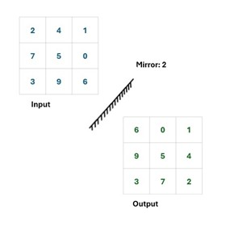
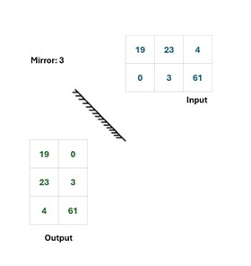

## **Smoke and Mirrors**

Chef likes to store his spices in numbered bottles arranged in a rectangular cart (grid). Sometimes, when the restaurant is slow, the Chef entertains himself by placing a mirror at one of the corners of the cart and predicting the reflected image of the spice bottles.
The cart is represented as an `m × n` grid of integers, where each cell contains a unique number. The four corners of the grid are labelled as follows:

- Top-left corner is labelled 0.
- Top-right corner is labelled 1.
- Bottom-right corner is labelled 2.
- Bottom-left corner is labelled 3.

Given the initial configuration of the grid and the label of the corner where the mirror is placed, your task is to determine the reflected image of the grid. Note that the reflection might change the dimensions.

### **Constraints:**
- _1≤_ 𝑚 , 𝑛 _≤100_
- _0 ≤ 𝑐 ≤ 3_



### **Input Format:**
The first line contains a number `t`. The next `t` times the consecutive line will be as follows:
- The next line contains two integers 𝑚 and 𝑛 (1≤ 𝑚,𝑛 ≤100) — the number of rows and columns in the grid.
- The next 𝑚 lines each contain 𝑛 integers, representing the grid of spice bottles.
- The last line contains an integer 𝑐 (where 0 ≤ 𝑐 ≤ 3) representing the corner where the mirror is placed.

### **Output Format:**
- Output the reflected image of the grid after placing the mirror at the specified corner. the output dimensions will be `𝑛 × 𝑚` for each of the `t` inputs.


### **Sample Input:**
```
2
3 3
1 2 3
4 5 6
7 8 9
2
2 4
1 2 3 4
5 6 7 8
1

```

### **Sample Output:**
```
9 6 3
8 5 2
7 4 1
1 5
2 6
3 7
4 8

```

### **Explanation:**
Given number of test cases: 2
- First Test case: 3x3
- Mirror for first test case: 2 \
_“Mirror 2” creates a mirror image of the given matrix along the line drawn at the bottom left corner, similar to the illustration given. Mirror-image matrix is the required answer._

- Similarly for second case:
- Matrix is 2x4, and mirror 1\
_So the mirror image of this matrix will return another matrix of size 4x2 (from 2x4) and the mirror is placed along the line drawn at the upper right corner._


### **Solution [O(n^2)]:**

```python
t = int(input())
for i in range(t):
    r , c = input().split()
    grid = []
    for i in range(int(r)):
        grid.append(list(input().split()))
    mirror =int( input())

    def transpose_grid(grid):
        return [[grid[j][i] for j in range(len(grid))] for i in range(len(grid[0]))]

    def mirror_grid(grid, mirror):
        if mirror in [0,2]:
            grid.reverse()
            for row in grid:
                row.reverse()
            grid = transpose_grid(grid)
            return grid
        if mirror in [1,3]:
            grid = transpose_grid(grid)
            return grid

       
    for row in mirror_grid(grid, mirror):
        print(" ".join(row))

```
