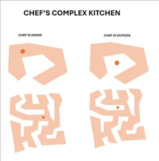

## **Kitchen**
Chef has a massive kitchen, which from a top view, resembles a very complex polygon. Since the kitchen is so large and oddly shaped, the Chef sometimes gets confused and can't figure out whether he is inside or outside the kitchen.

Given the coordinates of the vertices of the polygon (in order) that defines the kitchen's boundary and Chef's current coordinates, help Chef determine whether he is inside or outside the kitchen.

Chef’s coordinates can also intersect with kitchen walls or corners, and in such cases the answer should be `n`.

Your task is to determine if the Chef is inside the polygon-shaped kitchen or outside it.


### **Constraints:**
- _3 ≤ N ≤ 100_



### **Input Format:**

- The first line contains an integer `N`  — the number of corners of the kitchen.
- The next line contains integers `xi`, `yi` — the coordinates of the kitchen’s corners in order. (points separated by <comma+space> and x, y separated by <space> 
- The last line contains two integers `x_c` and `y_c` — Chef's current coordinates.


### **Output Format:**

Output a single character `y` if Chef is inside the kitchen, or `n` if Chef is outside.

### **Sample Input:**
```
10
2 4, 0 4, 0 8, -1 3, -4 4, -2 2, -4 0, -2 0, 2 -2, 0 2
0 0 
```

### **Sample Output:**
```
y
```

### **Explanation:**
On the first line, we give input that the kitchen has **10 corners** (polygon has 10 vertices), then the next line has the vertices (integer pair on cartesian plane) in sequence/order. `X` and `Y` separated by space, and two points separated by <comma+space> last and final line have chef’s coordinates on the same cartesian plane.

Now the given closed shape forms a polygon similar to a five-point star, and the given coordinates of chef lie inside this shape when plotted down, so the correct answer is `y`, denoting that chef is inside the kitchen.


### **Solution [O(n)]:**

```python
class Point:
    def __init__(self, x, y):
        self.x = x
        self.y = y

def point_in_polygon(point, polygon):
    x, y = point.x, point.y
    inside = False

    p1 = polygon[0]

    for i in range(1, len(polygon) + 1):

        if p1.x == x and p1.y == y:
            return False

        p2 = polygon[i % len(polygon)]

        if min(p1.y, p2.y) <= y <= max(p1.y, p2.y) and min(p1.x, p2.x) <= x <= max(p1.x, p2.x):
            if (p2.x - p1.x) * (y - p1.y) == (p2.y - p1.y) * (x - p1.x):
                return False

        if min(p1.y, p2.y) < y <= max(p1.y, p2.y):
            if x <= max(p1.x, p2.x):
                x_intersection = (y - p1.y) * (p2.x - p1.x) / (p2.y - p1.y) + p1.x

                if p1.x == p2.x or x <= x_intersection:
                    inside = not inside
        p1 = p2

    return inside

if __name__ == "__main__":
    n = int(input())
    kitchen = [Point(*map(int, line.split(' '))) for line in input().split(', ')]
    chef = Point(*map(int, input().split()))

    if point_in_polygon(chef, kitchen):
        print("y")
    else:
        print("n")


```
