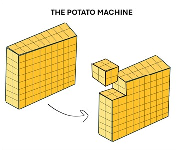

## **Potato**

Chef has invented an innovative machine that processes cuboid-cut potatoes into the largest possible perfect potato cubes in each turn. The smallest possible cube is a `1x1x1` unit. After all the potato has been transformed into cubes, the machine then converts each cube into perfect spheres, using the remaining scraps for his famous potato salad.
Chef wants to determine two things:

- The total number of spheres that can be formed from the processed cubes.
- The total volume of potato scraps left after processing the entire cuboid of dimensions `a*b*c`  (where `a`, `b`, `c` are the dimensions of the cuboid in cubic units).

Your task is to compute the total number of spheres Chef will obtain and the total volume of scraps remaining after processing the entire cuboid.
(Use pi = 355/113)

### **Constraints:**
- _1 ≤ T ≤ 5_
- _1 ≤ ( a, b, c ) ≤ 500_



### **Input Format:**

- The first line contains an integer `T` the number of test cases. 
- Second line contains three integers `a`, `b`, `c` representing the dimensions of the cuboid in cubic units.

### **Output Format:**

Output `T*2` integers on separate lines: the total number of spheres and the total volume of scraps (rounded to int) for each test case.


### **Sample Input:**
```
1
3 6 7
```

### **Sample Output:**
```
22
60
```

### **Explanation:**
For the example test case, we have a cuboid of dimensions `3 x 6 x 7`

The biggest possible cube is of `3x3x3`, so on removing that cube we split the remainder of the 3d figure into 2 parts: a bigger and smaller cuboid with total volume equal to original volume minus `3x3x3` volume.

now each cuboid obtained so will undergo the same process until it reduces to with one side with zero or one size, in which we return the base cases (recursion)

So with each obtained cube we map the count in a dictionary, and we get a total of **22** perfect cubes with the remainder returning the biggest possible each time.

now each cube of some side length `k` in the map will be cut into perfect sphere, so scrap is constant `(k*(1-pi/6))` cube units, and on summation, we get this value as **60** for given conditions.


### **Solution [O(2^n)]:**

```python
pi = 355 / 113
factor = 1 - pi / 6

def vol(dim):
    return dim[0] * dim[1] * dim[2]

def blocks(dim):
    n_cubes = 0
    dim = tuple(sorted(dim))

    if not dim[0]:
        return 0
    if dim[0] == 1:
        cubes[1] += dim[1] * dim[2]
        n_cubes += dim[1] * dim[2]
        return n_cubes

    n_cubes += 1
    cubes[dim[0]] = cubes.get(dim[0], 0) + 1

    return blocks((dim[1] - dim[0], dim[0], dim[0])) + blocks((dim[2] - dim[0], dim[1], dim[0])) + n_cubes

if __name__ == '__main__': 
    t = int(input()) 
    for _ in range(t): 
        cubes = {1: 0} 
        dim = tuple([int(i) for i in input().split()]) 
        print(blocks(dim)) 
        print(round(vol(dim) * factor))

```
